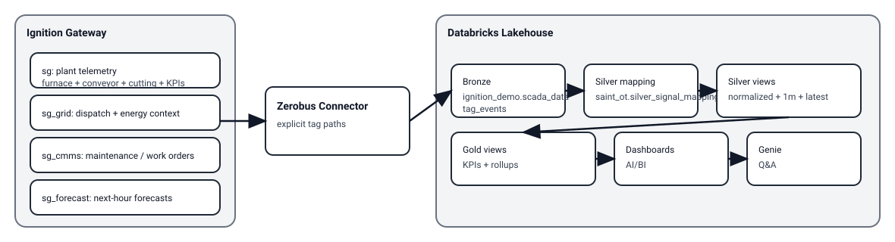

## Saint-Gobain “Glass Line” simulation (Ignition) — business demo

This demo is modeled after a **glass manufacturing line** (furnace → forming → conveyor → cutting) and is designed to tell a full “OT → Lakehouse → AI/BI” business story:

- Local plant OT equipment → Local Ignition
- OT/IT boundary (firewall/VPN/PrivateLink)
- Central Databricks lakehouse (Bronze → Silver → Gold)
- Multiple downstream consumers (BI, SAP, APIs)

The point of the demo is to show:

- **Operational outcomes**: “throughput vs target”, “scrap/quality improving”, “maintenance impact”
- **Data engineering outcomes**: raw tag events → normalized signals → KPIs
- **Analytics outcomes**: dashboards + Genie questions that map to plant outcomes

### Flow (pictorial)

### Provider names (recommended)

Use **separate providers per customer** so you can share a single Bronze table and still keep mapping clean:

- `sg` (plant telemetry)
- `sg_grid` (grid/dispatch inputs)
- `sg_cmms` (maintenance/work orders)
- `sg_forecast` (forecast)

> These can run alongside the Tilt demo on the same host.

### What’s included

Import JSON exports into the corresponding providers:

- `sg_site01_tags.json` → provider `sg`
- `sg_grid_site01_tags.json` → provider `sg_grid`
- `sg_cmms_site01_tags.json` → provider `sg_cmms`
- `sg_forecast_site01_tags.json` → provider `sg_forecast`

Gateway Timer Scripts (top-level scripts; paste as-is):

- `timer_script_sg_site01_plant.py` (1s)
- `timer_script_sg_site01_grid.py` (1s)
- `timer_script_sg_site01_cmms.py` (2s)
- `timer_script_sg_site01_forecast.py` (5s)

Each provider has `Diagnostics/*` tags:

- `TickCount` increments when the script runs
- `LastRun/LastStatus/LastError` are quick “self-debug” signals

### Demo tag model (glass production line)

`[sg]SG/Site01/...`

- Furnace (melting/forming temps, pressure, gas flow)
- Conveyor (speed, load, vibration)
- Cutting station (cut count, blade temp, quality score)
- KPIs (line throughput, scrap rate proxy)

`[sg_grid]SG/Site01/...`

- Dispatch inputs: `TargetRate_units_per_min`, `Curtailment_pct`, `ConstraintActive`
- Energy context (for cost story): `GasPrice_EUR_per_GJ`, `ElectricityPrice_EUR_per_MWh`
- Events: `EnergySpikeActive`, `LastEvent`

`[sg_cmms]SG/Site01/...`

- Work order counts + forced outage flags per asset (furnace/conveyor/cutting)

`[sg_forecast]SG/Site01/...`

- Next-hour forecast of **throughput + scrap** with a confidence %

### What to ingest (Zerobus “Explicit Tag Paths”)

You can ingest *folders* if you want, but for demos it’s easiest to use explicit paths so you control scope.

Minimum “business story” paths:

- Plant (`sg`)
  - `[sg]SG/Site01/Furnace/Temperature_Melting_C`
  - `[sg]SG/Site01/Furnace/Temperature_Forming_C`
  - `[sg]SG/Site01/Furnace/Pressure_Chamber_bar`
  - `[sg]SG/Site01/Furnace/Gas_Flow_m3h`
  - `[sg]SG/Site01/Furnace/Glass_Thickness_mm`
  - `[sg]SG/Site01/Conveyor/Speed_mpm`
  - `[sg]SG/Site01/Conveyor/Vibration_mms`
  - `[sg]SG/Site01/CuttingStation/Quality_Score`
  - `[sg]SG/Site01/KPIs/Throughput_units_per_min`
  - `[sg]SG/Site01/KPIs/ScrapRate_pct`

- Grid/dispatch (`sg_grid`)
  - `[sg_grid]SG/Site01/Dispatch/TargetRate_units_per_min`
  - `[sg_grid]SG/Site01/Dispatch/Curtailment_pct`
  - `[sg_grid]SG/Site01/Dispatch/ConstraintActive`
  - `[sg_grid]SG/Site01/Energy/GasPrice_EUR_per_GJ`
  - `[sg_grid]SG/Site01/Energy/ElectricityPrice_EUR_per_MWh`
  - `[sg_grid]SG/Site01/Events/EnergySpikeActive`

- Maintenance (`sg_cmms`)
  - `[sg_cmms]SG/Site01/WorkOrders/ActiveCount`
  - `[sg_cmms]SG/Site01/WorkOrders/HighPriorityCount`
  - `[sg_cmms]SG/Site01/Assets/Furnace/ForcedOutage`
  - `[sg_cmms]SG/Site01/Assets/Conveyor/ForcedOutage`
  - `[sg_cmms]SG/Site01/Assets/CuttingStation/ForcedOutage`

- Forecast (`sg_forecast`)
  - `[sg_forecast]SG/Site01/Forecast/H01/Throughput_units_per_min`
  - `[sg_forecast]SG/Site01/Forecast/H01/ScrapRate_pct`
  - `[sg_forecast]SG/Site01/Forecast/H01/Confidence_pct`

Optional debug (don’t need for business story):

- `[sg]SG/Site01/Diagnostics/TickCount`
- `[sg_grid]SG/Site01/Diagnostics/TickCount`
- `[sg_cmms]SG/Site01/Diagnostics/TickCount`
- `[sg_forecast]SG/Site01/Diagnostics/TickCount`

### Databricks: Bronze → Silver → Gold (Saint-Gobain schema)

This demo **reuses the same Bronze table** you already have:

- **Bronze**: `ignition_demo.scada_data.tag_events`

and builds Saint-Gobain layers in a dedicated schema:

- **Silver/Gold**: `ignition_demo.saint_ot`

Run these in order:

- `tools/databricks_end2end_sg/10_silver_scaffolding.sql`
  - Creates `silver_asset_registry`, `silver_signal_mapping`, and view `silver_events_normalized`
- `tools/databricks_end2end_sg/11_seed_site01_mapping.sql`
  - Seeds mapping from **tag_path → asset_id + signal_name + unit + domain**
- `tools/databricks_end2end_sg/20_silver_views.sql`
  - Creates convenience views like `silver_signals_1m`, `silver_signals_latest`, `silver_maintenance_events`
- `tools/databricks_end2end_sg/30_gold_views.sql`
  - Creates KPI views: `gold_site_kpis_5m`, `gold_site_kpis_daily`, `gold_forecast_accuracy_hourly`

Notes:

- These are mostly **views** over Bronze + mapping, so as new Bronze events arrive the Silver/Gold views reflect them automatically.
- If you change tag names, re-run **`11_seed_site01_mapping.sql`** to update mapping.

### Dashboards (suggested)

Use `tools/databricks_end2end_sg/40_dashboard_queries.sql` as a starter set. Recommended dashboards:

- **Operations overview** (last 6h): throughput vs target, scrap %, quality score, curtail/constraint, work orders
- **Energy + cost story (optional)**: energy prices vs constraint vs throughput (cost proxy in daily KPI view)
- **Maintenance impact**: forced outage flags + work order counts vs throughput/scrap
- **Forecast accuracy**: next-hour throughput forecast accuracy trend + confidence

### Genie room (suggested tables + questions)

Use `tools/databricks_end2end_sg/50_genie_room_seed.md`.

Suggested tables/views to add:

- `ignition_demo.saint_ot.gold_site_kpis_5m`
- `ignition_demo.saint_ot.gold_site_kpis_daily`
- `ignition_demo.saint_ot.gold_forecast_accuracy_hourly`
- `ignition_demo.saint_ot.silver_signals_1m` (drilldown)
- `ignition_demo.saint_ot.silver_maintenance_events` (drilldown)

Example questions:

- “Why is throughput below target right now?”
- “Is scrap rate increasing? What changed first: furnace temps, vibration, or quality score?”
- “Are there any forced outages active (furnace/conveyor/cutting)?”
- “How many active work orders do we have, and how many are high priority?”
- “How accurate is the next-hour throughput forecast today?”

