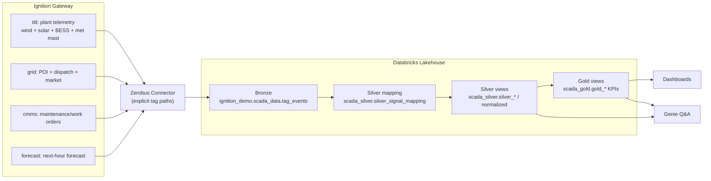

### Tilt Renewables “Site01” simulation (Ignition) — end-to-end OT demo

This example is a richer, **multi-asset** Tilt Renewables demo (not just wind). It is designed to showcase:

- **Ingest** (Ignition → Databricks Zerobus → Bronze table)
- **Silver** (normalized, typed time series + dimensions)
- **Gold** (KPIs and operations analytics)
- **Dashboards** (AI/BI dashboards in Databricks)
- **Genie** (natural-language questions against Gold/Silver)

This demo uses **Memory tags** + **Gateway Timer Scripts** (Jython) so it works without external hardware.

## Flow (pictorial)

## What’s included

This demo uses **four “sources”** (four tag providers) to make the business story realistic:

- **Plant telemetry SCADA**: `[tilt]...` (Wind + Solar + BESS + Met)
- **Grid + market**: `[grid]...` (POI meter, dispatch target, curtailment, price)
- **Maintenance / CMMS**: `[cmms]...` (forced outage flags, work orders, reasons)
- **Forecast**: `[forecast]...` (next-hour forecasts for wind/solar/net)

Included files:

- **`tilt_sim_site01_tags.json`**: Import into provider **`tilt`**.
- **`grid_sim_site01_tags.json`**: Import into provider **`grid`**.
- **`cmms_sim_site01_tags.json`**: Import into provider **`cmms`**.
- **`forecast_sim_site01_tags.json`**: Import into provider **`forecast`**.

Gateway Timer Scripts (create 4 timers at 1s or 2s):

- **`timer_script_site01_plant_telemetry.py`**
- **`timer_script_site01_grid_market.py`**
- **`timer_script_site01_maintenance_events.py`**
- **`timer_script_site01_weather_forecast.py`**

Each provider has `Diagnostics/*` tags:

- `TickCount` increments when the script runs
- `LastRun/LastStatus/LastError` are quick “self-debug” signals

## Demo tag model (Tilt Renewables multi-asset)

`[tilt]Tilt/Site01/...`

- `Windfarm01` (turbines, site wind, availability)
- `SolarFarm01` (inverters, irradiance coupling)
- `BESS01` (SOC, charge/discharge, limits)
- `MetMast01` (wind speed, direction, irradiance)

`[grid]Tilt/Site01/...`

- `Substation01/POI/*` (export power, frequency)
- `Dispatch/*` (target and curtailment)
- `Market/*` (price + events)

`[cmms]Tilt/Site01/...`

- `WorkOrders/*` + forced outage flags/reasons

`[forecast]Tilt/Site01/...`

- next-hour forecasts for wind/solar/net

## 1) Create the tag providers

In the Gateway UI:

- Go to **Configure → Tags → Realtime Tag Providers**
- Create **four** **Standard Tag Providers**:
  - `tilt`
  - `grid`
  - `cmms`
  - `forecast`
- Ensure each is **Enabled** and **NOT Read Only**

> The provider names matter because each JSON export assumes you import into the matching provider.

## 2) Import the tags

In the Designer:

- Open **Tag Browser**
- For each provider, select it and import its JSON:
  - Provider `tilt` → import `tilt_sim_site01_tags.json`
  - Provider `grid` → import `grid_sim_site01_tags.json`
  - Provider `cmms` → import `cmms_sim_site01_tags.json`
  - Provider `forecast` → import `forecast_sim_site01_tags.json`

You should see (examples):

- `[tilt]Tilt/Site01/MetMast01/...`
- `[tilt]Tilt/Site01/Windfarm01/...`
- `[tilt]Tilt/Site01/SolarFarm01/...`
- `[tilt]Tilt/Site01/BESS01/...`
- `[grid]Tilt/Site01/Substation01/...`
- `[cmms]Tilt/Site01/...`
- `[forecast]Tilt/Site01/...`

## 3) Add the Gateway Timer Scripts (simulators)

Designer → **Scripting → Gateway Events → Timer**

- Delay Type: **Fixed Delay**
- Delay (ms): **1000**
- Enabled: **true**
- Create 4 timers and paste one script into each:
  - `timer_script_site01_plant_telemetry.py`
  - `timer_script_site01_grid_market.py`
  - `timer_script_site01_maintenance_events.py`
  - `timer_script_site01_weather_forecast.py`

## 4) Ingest (Zerobus module)

The module’s **direct subscriptions** currently support `tagSelectionMode = explicit` only.

Start with a small, high-signal list:

- `[tilt]Tilt/Site01/MetMast01/WindSpeed_mps`
- `[tilt]Tilt/Site01/MetMast01/Irradiance_Wm2`
- `[tilt]Tilt/Site01/Windfarm01/Turbines/T01/Electrical/Power_kW`
- `[tilt]Tilt/Site01/SolarFarm01/Inverters/I01/AC/Power_kW`
- `[tilt]Tilt/Site01/BESS01/Power/NetPower_kW`
- `[grid]Tilt/Site01/Substation01/POI/ExportPower_kW`
- `[grid]Tilt/Site01/Substation01/POI/Frequency_Hz`
- `[grid]Tilt/Site01/Dispatch/Curtailment_pct`
- `[cmms]Tilt/Site01/WorkOrders/ActiveCount`
- `[forecast]Tilt/Site01/Forecast/H01/NetPower_kW`

Then validate:

- `GET /system/zerobus/health`
- `GET /system/zerobus/diagnostics`

## 5) Databricks end-to-end (Bronze → Silver → Gold → Dashboards → Genie)

See:

- `tools/databricks_end2end_tilt/README.md`

Recommended run order in Databricks:

- `tools/databricks_end2end_tilt/10_silver_scaffolding.sql`
- `tools/databricks_end2end_tilt/11_seed_site01_mapping.sql`
- `tools/databricks_end2end_tilt/20_silver_views.sql`
- `tools/databricks_end2end_tilt/30_gold_views.sql`
- `tools/databricks_end2end_tilt/40_dashboard_queries.sql`
- `tools/databricks_end2end_tilt/50_genie_room_seed.md`

### Dashboards (suggested)

- **Fleet overview**: wind/solar/BESS/POI power, curtailment, price
- **Constraint story**: dispatch target vs actual vs curtailment, “why did we under-deliver?”
- **BESS ops**: SOC, net power, charge/discharge cycles, limits/alarms
- **Maintenance impact**: forced outages + work orders vs lost production proxy
- **Forecast vs actual**: next-hour forecast accuracy and confidence

### Genie room (suggested tables + questions)

Use `tools/databricks_end2end_tilt/50_genie_room_seed.md`.

Suggested sources to add:

- Gold KPI views (from `tools/databricks_end2end_tilt/30_gold_views.sql`)
- `...silver_signals_1m` / `...silver_signals_latest` (drilldown)

Example questions:

- “What’s driving curtailment right now and how much energy are we spilling?”
- “Show POI export vs wind + solar + BESS net power in the last 6 hours.”
- “Which turbine is underperforming relative to wind speed?”
- “How often did BESS hit charge/discharge limits today?”
- “How accurate is the next-hour net power forecast?”

